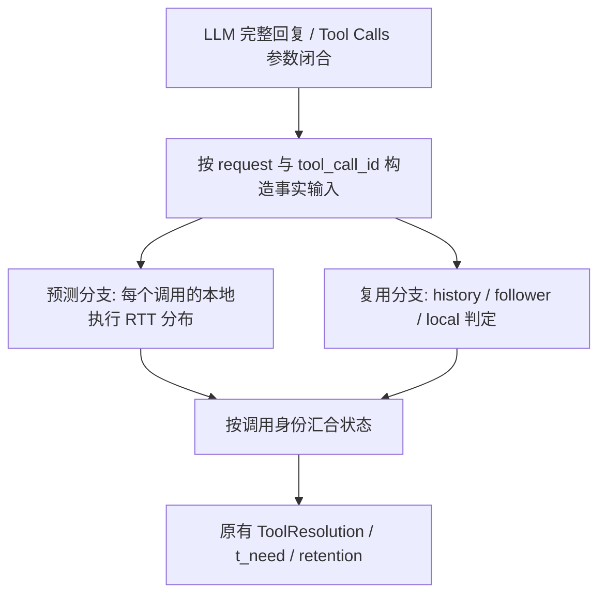

# FlowPilot 预测接入方案：并行预测与复用判断（2026-09-28 修订）

> 后续实施更新：已新增 `flowpilot_predictor_bridge/`、`configs/predictor/runtime.json` 和适配测试。预测侧现支持 T1 并发、Q50/Q90 → `duration_estimate_ms`、真实 RTT 驱动的在线偏差校正；原树模型保持不变。实际代码和限制以 [适配层说明](flowpilot_predictor_bridge/README.rst) 为准。下文为前期设计，完整框架消费端尚未绑定。

本文按用户最新要求修订。**在 LLM 返回完整工具调用后，每个请求都进入预测流程；工具耗时预测与缓存/复用判断并行，多个请求之间也并发预测。预测器以 `/root/flowpilot_predictor` 当前实现为准，OpenHands 保留用户已有适配器与全部修改。** 本次完成拼接前的仓库、备份、版本和验证准备，尚未实现完整系统连接。

上一版“确认本地执行之后才触发预测”和“先用单个模型任务”的建议已撤销；它们不再作为实施依据。原文仅保存在 [修订前存档](/root/flowpilot_integration_20260928/baselines/PREDICTOR_INTEGRATION_PLAN_before_parallel_revision.md) 供追溯。

## 1. 本地工作区与代码优先级

整合工作区：`/root/flowpilot_integration_20260928/`。

| 目录 | 内容与权威来源 |
| --- | --- |
| `flowpilot/` | MYST000/flowpilot 的 main 快照，独立准备分支 |
| `vllm/` | MYST000/vllm 的 main 快照，独立准备分支 |
| `openhands/` | 从用户本地 SDK 克隆，包含用户提交、已修改与未跟踪文件；upstream 指向 MYST000 |
| `predictor/` | 指向 `/root/flowpilot_predictor` 的软链接，以用户当前工作区为唯一预测器来源 |
| `baselines/` | Git history bundle、staged/unstaged 补丁、工作文件归档、逐文件哈希、LightGBM 备份 |
| `manifest.json` | 仓库 SHA、来源、保留状态及修订后的接入契约 |
| `scripts/`、`evidence/` | 准备与验证脚本、测试及并发检查证据 |

三个整合仓库均使用 `integration/predictor-prep-20260928` 分支。未推送、未提交用户现有变更。原 SDK/预测器目录及其 Git 暂存状态保留；本文件是上一轮由助手生成、按用户纠正修订的方案文档，不属于模型源码。

| 组件 | 本地整合基线 |
| --- | --- |
| FlowPilot | `7a10e58402104c2bfe9bdd2992291d097801864e` |
| vLLM | `db3e9f371f4224b02dee5e5046dc81470c481654` |
| OpenHands 上游 main | `a6db5dcba26a3acfaeac58c8ba5195433a0e223d` |
| OpenHands 用户分支 | `2b788bf22e7449ed6cdc70abaefe7c680161f039`，在上游之上有两个用户提交 |

OpenHands 的两个提交 `8e8ed520`、`2b788bf2` 和工作区中 7 个修改、2 个未跟踪文件已保留。上游 main 是用户分支祖先，当前无需合并冲突。后续新上游到来时逐项整合，禁止用上游文件覆盖用户 adapter。

预测器原代码、配置和冻结工件优先。不要从远端较旧 predictor HEAD 还原文件，也不要更改正式模型、重新训练或顺便调参。

## 2. 正确时序：预测和复用判断并行



1. LLM 返回的是**工具调用指令**，不是工具已经执行完的结果。解析本轮真实工具名、参数、批次顺序后立即分叉。
2. **每个 request 都进入预测入口**，每个完整 Tool Call 都尝试预测，不因 history hit 或 follower 跳过。无工具回复记录 `no_tool`；未知工具/非法参数记录明确原因，不伪造数值。
3. 预测分支不等待缓存查找；缓存分支不等待预测。预测先完成可暂存，复用结果先返回即可沿原控制流推进。
4. 命中后也可完成该调用已触发的预测，保留用于诊断；不能仅因为 hit 就把预测入口短路。真实终止/取消/身份失效时仍按生命周期清理。
5. **消费阶段**区分路径：local 使用 RTT 先验；history hit 使用真实复用事实；follower 使用现有 leader 进度/ready-time。预测不会覆盖真实完成事实。
6. 没有等齐两条分支的全局屏障，也不要求所有请求完成预测再推进一个请求。local 执行不为等预测而延迟；晚预测能否补入运行中调用由现有 resolution 的身份/时序规则决定。

“所有请求都预测”是触发条件，“只有需要时消费 RTT 先验”是结果使用条件，不能将两者合并为 miss 后才计算。

## 3. 命中请求的预测目标如何定义

现有 LightGBM 学习的是 `round_trip_ms`，即**这个工具若实际本地执行时的客户端 RTT**。即使命中，也可以在相同工具和参数上计算这份本地执行耗时预测；它不自动成为命中交付时间或 follower 等待时间。

模型当前 `Base.context_error()` 要求 `resolution` 为 `LOCAL_ONLY/LOCAL_LEADER`，这是现有模型的调用前置检查，不是预测必须等待缓存结论的理由。后续 bridge 应明确区分：

```text
model_target = local_execution_rtt
model_context = 已知工具/参数/历史/负载 + 本地执行假设
actual_resolution = UNKNOWN → HISTORICAL_HIT / INFLIGHT_FOLLOWER / LOCAL_*
```

为了调用未修改的旧模型，bridge 可在**独立复制的模型输入**中使用 `resolution=LOCAL_ONLY` 表示本地执行假设。真实 resolution 始终保存在框架权威状态中，不改写为 LOCAL_ONLY。预测记录必须注明假设目标，不能把该占位值当成实际 cache miss。

这是一层输入兼容适配，不需要修改 LightGBM 树、训练代码或复用策略。未知 backend/tool/schema 仍然返回 unsupported；“每次触发”不意味着对未训练工具凭空给出可靠数值。

命中/follower 的实际耗时不能作为本地执行模型的 RTT 标签。没有真实执行，就没有该次反事实 RTT 的可观测真值；不能将其作为 0 ms 误差反馈或更新本地执行历史。

## 4. 跨 request 并发

多个 request 的预测应能同时执行，例如 A、B 的完整回复到达后，A 的模型计算不能阻止 B 进入另一个执行槽。单请求内部原有 `tool_concurrency_limit=1` 表示工具按序执行，与预测服务的跨请求并发无关。

建议部署结构：

```text
接入事件循环
  ├─ request A: cache resolve task + prediction future A
  ├─ request B: cache resolve task + prediction future B
  └─ request C: cache resolve task + prediction future C

预测 CPU worker pool: 可配置 K >= 2，每个 worker 常驻加载用户模型
```

首轮可用两个进程隔离模型副本，避免不同请求修改共享模型或上下文；每个 worker 使用独立不可变输入，启动时加载/warm-up，不按调用重新加载。模型默认内部线程数为 8，K 与内部线程数要一起核对 CPU 预算；当前不改工件配置、不声称 2×8 是最优值。

采用有界队列/并发槽，默认健康容量下所有请求均尝试预测。饱和时记录明确 overload/超时状态，不拖住工具、网关或 hit 返回，也不按 cache outcome 选择性跳过。预测计算必须移出事件循环；仅声明 `async def` 不会让 CPU 推理自动并行。

取消协程不等于 native LightGBM 已停止。执行槽只在真实计算结束后归还；晚结果通过身份/版本检查丢弃。每个请求独立完成、独立超时，不能用等待所有任务的全局 gather 阻塞返回。

## 5. 接口与框架连接

`idea/接口.txt` 给出的 `ForecastAdapter` 按 `idea/design.md` 在 LLM 请求到达时运行，而当前模型在回复后 T1 才有完整工具参数。这个时机差异仍需在拼接时解决，但**不应以等待复用判断来解决**。

推荐增加 T1 逐调用 duration adapter，保留 T0 forecast 原语义：

```python
class ToolDurationAdapter(Protocol):
    async def predict(self, request: ToolDurationRequest) -> ToolDurationResult: ...
    async def cancel(self, prediction_key: PredictionKey) -> None: ...
```

这是拟议接口，不是声称当前公开仓库已经存在。入口触发位于完整工具调用形成后、reuse 分叉前。若同门希望复用 ForecastAdapter 名称，也必须明确 T1 stage、per-call ID 与晚到校验语义，不能继续按“事实 Tool 已出现就丢弃”处理 T1 输出。

最小输入包括 job/line/request/tail/call/attempt/tool_call_id、context/tail 版本、backend/tool/schema、参数、batch、T0 历史/负载/预算、T1 快照 age。真实 resolution 不作为推理启动必需字段；结果写入时读取最新权威 resolution。

输出：

```text
prediction_key / valid_for
target = local_execution_round_trip_from_dispatch
duration_ms = {q10, q50, q90, q99}
model_version / feature_version / support / fallback_reason
as_of / generated_at / expiry
```

内部 per-call 四分位数保留，local 分支消费 Q50 写入现有 `duration_estimate_ms`，Q90 先供诊断。首版建议使用同一 raw 模型输出，避免在接入阶段混合不同校准版本。概率与 Q90 不是同一概念，不伪造 tool-family probability/confidence。

结果汇合使用 `(job, line, request/call/attempt, tool_call_id, context_epoch)` 等权威身份。同批次两个 search 即使工具族相同也分别预测。参数摘要、tail/上下文和状态版本变化后，旧结果不能回写新调用。START 先到、FINISH 先到、hit 先到、预测先到四类顺序均需测试。

## 6. 保持用户模型与适配器的语义

- backend 支持键是 `(backend_id, backend_version, tool_name, tool_schema_version)`。模型当前覆盖 hotpot_rpc、browsecomp_mcp、local-process-pilot 的六个工具。
- backend_version 包含 environment、dataset_revision、actor/replica_id、执行 profile；新环境不能随意套用旧 hash。先复现已有后端，兼容映射必须明确版本与语义证据。
- T0 历史/负载在 T1 使用时保留 age，不把网关全局负载当作原客户端 load monitor。history 只含 T0 前已结束的真实本地调用，保持最近 64 条等训练口径。
- arguments 按原 schema 补默认值；batch_size 按提议调用统计，不按成功数统计；configured timeout 不能偷用未来 dispatch 才确定的 effective timeout。
- 客户端 monotonic 只在同域相减；网关 TTL 用自己的单调时钟。RTT 不是 next-request-ready、远端 executor 时间或 KV 恢复时间。
- 预测完整 RTT 不代表运行中剩余时间；不能将晚到完整 RTT 再加到当前时刻。保持同门原有点投影规则并检查起止端点。
- `RecordedLLM` 实验 UUID 需要与同门 runtime 的权威身份做映射，不能另造一套身份回写框架。原有工具包装、Action/Observation 和计时逻辑保留。
- 新 bridge 放在并列包 `flowpilot_predictor_bridge/`，避免向 `predictor/*.py` 添加文件触发已有 model/code 哈希字典不匹配。当前没有创建该生产包。

正式模型仍是：

```text
runs/predictor_experiments/20260927T170043Z/lightgbm/model.joblib
version: tool-rtt-v2:lightgbm:edec942525275ae4
SHA256: f32abacd7355f07ec2be179b65d2e36c99d6a4f065db3c00b48fc9bccef6f57b
```

## 7. 拼接改动范围

| 部分 | 后续最小工作 |
| --- | --- |
| 用户预测器 | 保留原实现/工件；外加加载、并发调度、假设输入与输出封装 |
| 用户 OpenHands adapter | 增加 runtime 身份桥接、T0/T1 内存快照、异步提交与反馈 observer |
| FlowPilot 接线 | 完整 Tool Call 后并行启动预测/reuse；独立接收 per-call 结果，按真实状态更新先验 |
| 同门策略 | 沿用 cache/reuse、t_need、admission、retention 公式与动作 |
| vLLM | 使用已拉取的 KV 扩展，无预测器代码改动 |

Tool 结果缓存和复用按当前源码属于 FlowPilot；vLLM 拥有 KV 物理状态和恢复执行。不能将预测器嵌入 vLLM GPU 热路径，也不为预测新增任何工具复用授权。

## 8. 后续验收重点

1. 三个请求可同时处于模型计算阶段，结果不串请求；单请求工具串行约束不受影响。
2. hit/miss/follower 均记录预测启动，cache resolve 未完成时预测已可进行。
3. cache hit 快于预测时，命中结果立即交付，预测结果仅诊断；不额外等待或改写完成状态。
4. miss 晚于预测时，直接消费已有 Q50；miss 早于预测时，执行继续，晚结果按时序决定能否补入。
5. unknown backend、模型异常、过载、超时不阻塞网关；保留可观测失败原因。
6. 同族多 Tool Call、请求重试、新 tail、取消、重复反馈均正确隔离。
7. 逐调用预测误差只在真实 local RTT 可观测时计分；hit/follower 单列，不混入本地执行模型训练。
8. 开关对照只改变预测输入来源，不改变已有策略公式；shadow 与主动回写分阶段验收。

## 9. 当前边界与准备证据

刷新远端后，公开 FlowPilot 仍没有设计中的 `scheduling/forecast.py` / resolution，OpenHands 上游仍没有 `sdk/flowpilot.py`。这不妨碍先保留用户代码并准备仓库；后续拼接仍需与同门文档对应的源码或补丁。不能把这部分缺失隐含地变成重写其他策略的任务。

本次准备记录、精确文件校验、适配器回归及冻结模型并发检查以 [工作区说明](/root/flowpilot_integration_20260928/README.md) 和 [manifest](/root/flowpilot_integration_20260928/manifest.json) 为准。未训练、未调参、未启动 GPU，也未宣称在线系统已经接通。

## 2026-09-28 实时工具 RTT 对接补充

确认用户的 `ContainerExecutor` 与 `RetrievalExecutor` 已用 `monotonic_ns` 记录每次
真实执行的 `round_trip_ms`（另有 executor duration，不能混用）。原来记录实时落盘，
没有把结果送回预测器。集成副本的 `TraceRecorder` 现新增可选反馈 observer，
预测目录新增 `flowpilot_predictor_bridge/openhands.py`，把该 RTT 有界、线程安全地
送到 `PredictorRuntime.observe`。不使用通用 pre/post hook 差值重定义训练目标。

每个 recorder 需显式注册 observer，每个本地 action 需绑定 SDK trace request/call/action
到框架完整调用身份。hit/follower 无本地样本；超时标签不用于在线校准。
注册示例见 bridge README。该功能仍是待目标框架装配的预测接口，不能表述成实际
调度算法已收到预测，也没有替换旧 benchmark runner 的默认行为。
